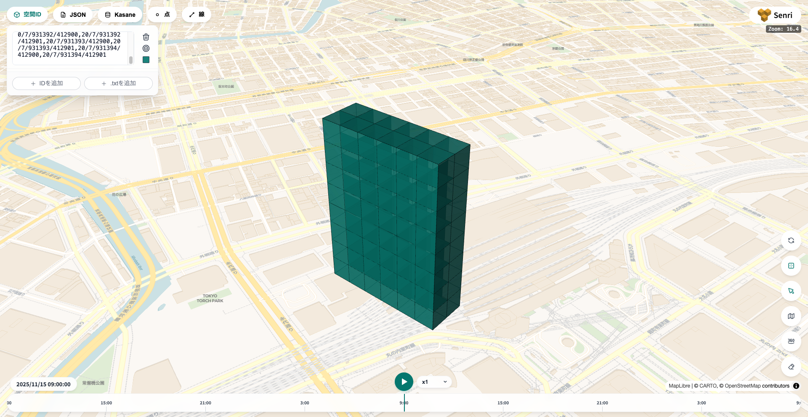
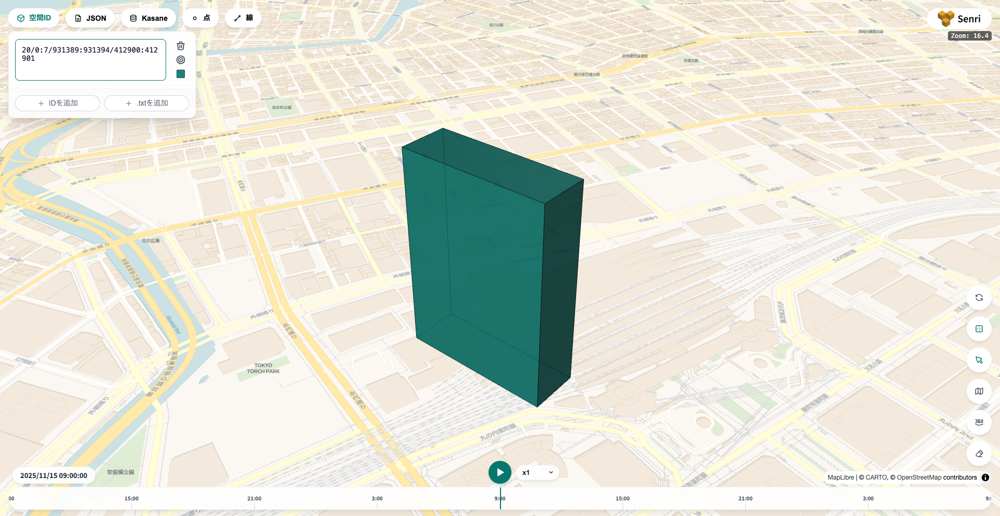

Kasane は、[ガイドライン](/concepts/spatial-id/)どおりの空間ID に加えて、それを拡張した 2 種類の空間ID を扱います。書き込み・検索・クエリにはどの種類も使え、検索結果の種類も選べます。

| 種類 | 表すもの | 例 |
| --- | --- | --- |
| SingleId | 1 ボクセル（ガイドラインどおりの空間ID） | `20/0/931389/412900` |
| RangeId | 軸ごとの範囲で表した直方体（Kasane の拡張） | `20/0:7/931389:931394/412900:412901` |
| FlexId | 軸ごとにズームレベルが違うボクセル（Kasane の拡張） | `20/0\|20/931389\|19/206450` |

## SingleId

ガイドラインの空間ID そのものです。東西 6 × 南北 2 × 高さ 8 の直方体は、SingleId では 96 個になります。

```text
20/0/931389/412900
20/0/931389/412901
20/0/931390/412900
…（途中省略）…
20/7/931394/412901
```



<p class="figure-caption">SingleId 96 個で表示</p>

## RangeId

各軸のインデックスを閉区間 `最小:最大` で書いた空間ID です。上の 96 ボクセルは 1 つで書けます。

```text
20/0:7/931389:931394/412900:412901
```



<p class="figure-caption">RangeId 1 個で表示</p>

## FlexId

軸ごとに `ズームレベル/インデックス` を持つ空間ID で、Kasane の内部の保存単位です。`20/0|20/931389|19/206450` は、y 方向だけズームレベル 19（ズームレベル 20 の 2 ボクセル分）です。

テーブルの count は FlexId の数です。隣り合うボクセルはまとめて保存されるので、書き込んだボクセルの数とは一致しません。

## 時間

時空間ID の時間間隔に使えるのは 1・60・3600・86400 秒です。時間を付けない空間ID は全時間の値になり、どの時刻で検索しても返ります（エラーメッセージでは時間間隔 `2^35` として現れます）。
