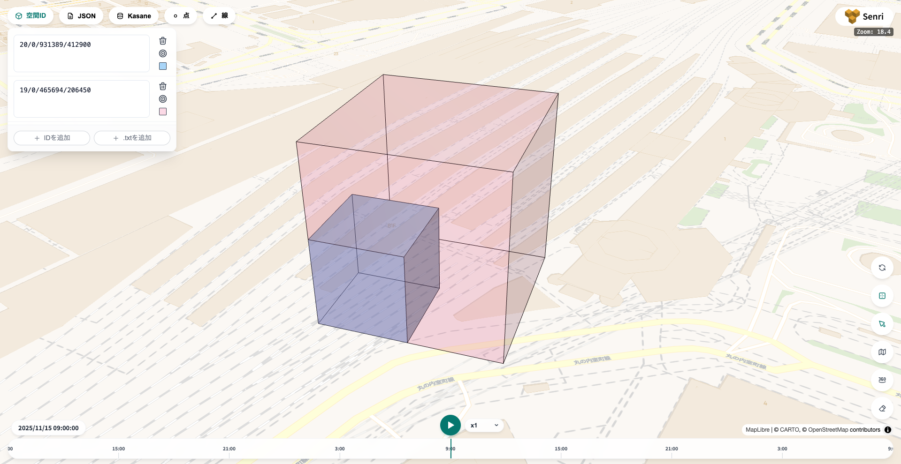
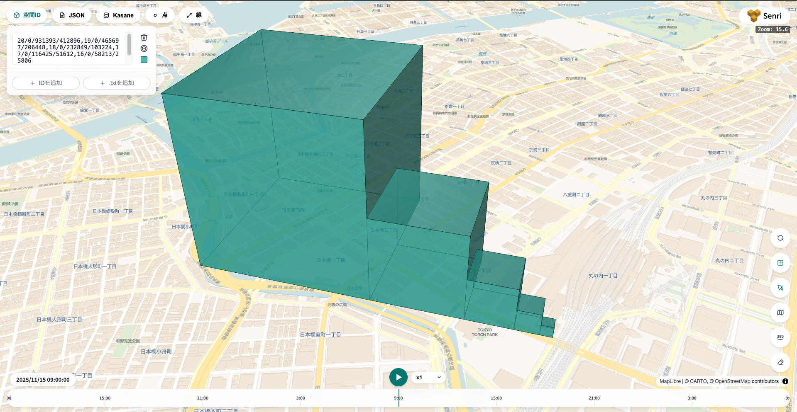
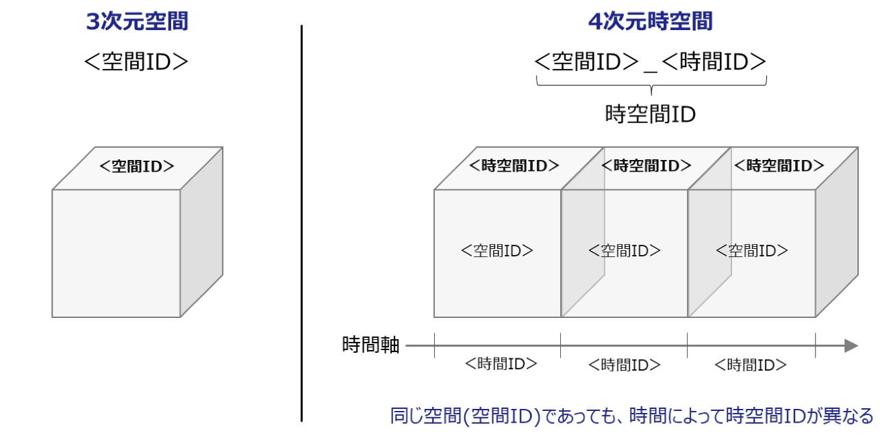
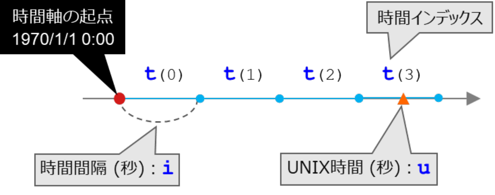

import TablerIcon from '../../../components/TablerIcon.astro';
import voxelFigure from '../../../assets/ipa/ipa-fig2-3-voxel.png';
import horizontalIndexFigure from '../../../assets/ipa/ipa-fig2-6-horizontal-index.png';

:::note[このページで学ぶこと]
- 空間ID の書き方と、ズームレベルの意味
- 緯度・経度から空間ID を求める方法
- 時空間ID（時間つきの空間ID）
- Kasane で空間ID を表す 3 つの形
:::

このページは、Kasane を使うための背景知識です。クライアントの使い方は[ガイド](/guide/install/)で説明しています。

このページの図の一部は、経済産業省・国土交通省・国土地理院・NEDO・IPA が公開している「4 次元時空間情報利活用のための空間 ID ガイドライン（1.2 版）」から引用しています。詳しい仕様はガイドライン本文を参照してください。

## 空間IDとは

空間ID は、地球上の空間を格子状に区切り、1 つ 1 つのボクセルに以下のようなインデックスをつけた規格です。

```text
{z}/{f}/{x}/{y}        例：2/0/3/1
```

<div class="side-by-side">
<div>

| 記号 | 意味 |
| --- | --- |
| `z` | ズームレベル |
| `f` | 高さ方向のインデックス |
| `x` | 東西方向のインデックス |
| `y` | 南北方向のインデックス |

</div>
<div class="side-figure-column">


<p class="figure-caption">図 2-3 空間IDのイメージ（出典：[空間 ID ガイドライン 1.2 版](https://www.ipa.go.jp/digital/architecture/Individual-link/rcu1hd000000upgf-att/4dspatio-temporal-id-guideline-v1_2.pdf)）</p>

</div>
</div>

## ズームレベルと親子関係

ズームレベルを 1 つ上げると、ボクセルは縦・横・高さが半分になり、8 つに分かれます。また、`f`・`x`・`y` をそれぞれ 2 で割って切り捨てると、1 つ粗いズームレベルの「親」のボクセルになります。

```text
3/0/7/2 の親 → 2/0/3/1
20/0/931389/412900 の親 → 19/0/465694/206450
```

<div class="figure-pair">
<div>



<p class="figure-caption">親（ピンク）の中に子（青）が入る様子</p>

</div>
<div>



<p class="figure-caption">ズームレベル 20〜16 のボクセルを並べた様子</p>

</div>
</div>

ボクセルの大きさの目安は次のとおりです。横幅は緯度が高いほど狭くなります。

<div class="side-by-side">
<div>

| z | 高さ | 横幅（東京付近） |
| --- | --- | --- |
| 15 | 1,024 m | 約 1 km |
| 20 | 32 m | 約 31 m |
| 25 | 1 m | 約 1 m |

</div>
<div class="side-figure-column">


<p class="figure-caption">図 2-6 水平方向の分割とインデックスの割り当て（出典：[空間 ID ガイドライン 1.2 版](https://www.ipa.go.jp/digital/architecture/Individual-link/rcu1hd000000upgf-att/4dspatio-temporal-id-guideline-v1_2.pdf)）</p>

</div>
</div>

各インデックスが取れる範囲は、`f` が −2<sup>z</sup> 〜 2<sup>z</sup> − 1、`x` と `y` が 0 〜 2<sup>z</sup> − 1 です。

## 緯度・経度・標高から空間IDを計算する
緯度、経度、標高から空間IDを計算するには、次の関数を使えます。`z` はズームレベル、`lng` は経度、`lat` は緯度、`h` は標高（メートル）です。

```ts
function toSpatialId(z: number, lng: number, lat: number, h: number) {
  const n = 2 ** z;
  const latRad = (lat * Math.PI) / 180;
  const f = Math.floor((n * h) / 2 ** 25);
  const x = Math.floor((n * (lng + 180)) / 360);
  const y = Math.floor((n / 2) * (1 - Math.log(Math.tan(latRad) + 1 / Math.cos(latRad)) / Math.PI));
  return `${z}/${f}/${x}/${y}`;
}

toSpatialId(20, 139.7671, 35.6812, 10); // "20/0/931389/412906"（東京駅）
```
## 空間IDを地図で見る

空間ID が指す場所は、地図ツール Senri で確かめられます。下に埋め込んでいるほか、[こちらから](https://map.airbee.jp/?debug)使うこともできます。

1. 左上の <TablerIcon name="cube" /> 空間ID ボタンを押します。
2. <TablerIcon name="plus" /> IDを追加 を押すと入力欄ができるので、空間ID を貼り付けます。カンマで区切れば、複数の ID をまとめて表示できます。
3. 表示された場所が見つからないときは、入力欄の右にある <TablerIcon name="target" /> を押すと、その場所へ移動します。
4. 入力欄の右にある ⬜︎ でボクセルの色を変更でき、<TablerIcon name="trash" /> で入力欄ごと消せます。

<iframe src="https://map.airbee.jp/?debug" title="空間IDの地図表示" loading="lazy" style="width: 100%; aspect-ratio: 16 / 10; border: 1px solid var(--sl-color-gray-5); border-radius: 4px;"></iframe>

画面右側のボタンの説明

- <TablerIcon name="refresh" />：範囲の表示と 1 ボクセルずつの表示を切り替えます。RangeId（`20/0/931389:931390/412900` など）を正確に表示したいときに押してください。
- <TablerIcon name="border-outer" />：ボクセルの枠線を表示します。
- <TablerIcon name="pointer" />：ボクセルにカーソルを合わせると、その空間ID が表示されます。
- <TablerIcon name="view-360-number" />：地図を自動で回転させます。

ほかに、<TablerIcon name="plus" /> .txtを追加 で空間ID を並べたテキストファイル（[Nazori](/docs/plateau/) の出力など）を読み込むこともできます。

## 時空間ID

空間ID の後ろに時間インデックスを付けたものです。同じ場所でも、時間が違えば別の時空間ID になります。

```text
{z}/{f}/{x}/{y}_{i}/{t}    例：20/0/931389/412900_3600/489768
```



<p class="figure-caption">図 2-21 空間 ID と時空間 ID の比較イメージ（出典：[空間 ID ガイドライン 1.2 版](https://www.ipa.go.jp/digital/architecture/Individual-link/rcu1hd000000upgf-att/4dspatio-temporal-id-guideline-v1_2.pdf)）</p>

時間軸は 1970-01-01 00:00（UTC、UNIX 時間の起点）から始まり、時間間隔 `i`（秒）ごとに区切られます。`t` は、UNIX 時間 `u` がその何番目の区間に入るかを表す番号で、`t = floor(u / i)` で求まります。



<p class="figure-caption">図 2-23 分割された時間軸における各要素（出典：[空間 ID ガイドライン 1.2 版](https://www.ipa.go.jp/digital/architecture/Individual-link/rcu1hd000000upgf-att/4dspatio-temporal-id-guideline-v1_2.pdf)）</p>

```ts
const t = Math.floor(Date.UTC(2025, 10, 15, 0, 0, 0) / 1000 / 3600); // 489768
// 20/0/931389/412900_3600/489768 は、2025-11-15 00:00〜01:00（UTC）
```

ガイドラインでは `i` に任意の秒数を使えますが、Kasane v0.7 で使えるのは 1、60、3600、86400 の 4 つです。時間を付けない ID は「全時間」を表し、内部では `i = 2^35` として扱われます。

## Kasane での 3 つの表現

Kasane では同じ空間を 3 つの形で書けます。書き込み・検索にはどれを渡してもよく、検索結果の形も `format` で選べます。

SingleId は 1 ボクセルを表す、ガイドラインどおりの形です。

```ts
// 東西 6 × 南北 2 × 高さ 8 = 96 ボクセルを、1 ボクセルずつ書く
SingleId.create(20, 0, 931389, 412900);
SingleId.create(20, 0, 931389, 412901);
SingleId.create(20, 0, 931390, 412900);
SingleId.create(20, 0, 931390, 412901);
// …（途中省略）…
SingleId.create(20, 7, 931394, 412900);
SingleId.create(20, 7, 931394, 412901);
// 全部で 96 個
```


<p class="figure-caption">SingleId 96 個で表示</p>

RangeId は、軸ごとの範囲（両端を含む）で直方体を表します。上の 96 ボクセルを 1 つの ID で書けます。

```ts
RangeId.create(20, [0, 7], [931389, 931394], [412900, 412901]); // "20/0:7/931389:931394/412900:412901"
```


<p class="figure-caption">RangeId 1 個で表示</p>

FlexId は、軸ごとに違うズームレベルを持てる形で、Kasane の内部の保存単位です。`20/0|20/931389|19/206450` は、y 方向だけズームレベル 19（= ズームレベル 20 の 2 ボクセル分）のボクセルを表します。

クライアントでの作り方は、ガイドの[空間ID を作る](/guide/spatial-ids/)で説明しています。

## まとめ

- 空間ID は `{z}/{f}/{x}/{y}` で 1 つのボクセルを表す。ズームレベルが 1 上がると、ボクセルは 8 つに分かれる
- 時空間ID は、空間ID の後ろに `_{i}/{t}` で時間を付けたもの。Kasane で使える時間間隔は 1・60・3600・86400 秒
- Kasane では、SingleId（1 ボクセル）・RangeId（直方体）・FlexId（内部の形）のどれでも書き込みや検索ができる

## 参考資料

- 経済産業省・国土交通省・国土地理院・国立研究開発法人 新エネルギー・産業技術総合開発機構・独立行政法人 情報処理推進機構「[4 次元時空間情報利活用のための空間 ID ガイドライン（1.2 版）](https://www.ipa.go.jp/digital/architecture/Individual-link/rcu1hd000000upgf-att/4dspatio-temporal-id-guideline-v1_2.pdf)」2026 年 6 月 4 日（図 2-3、2-6、2-21、2-23 を引用）
