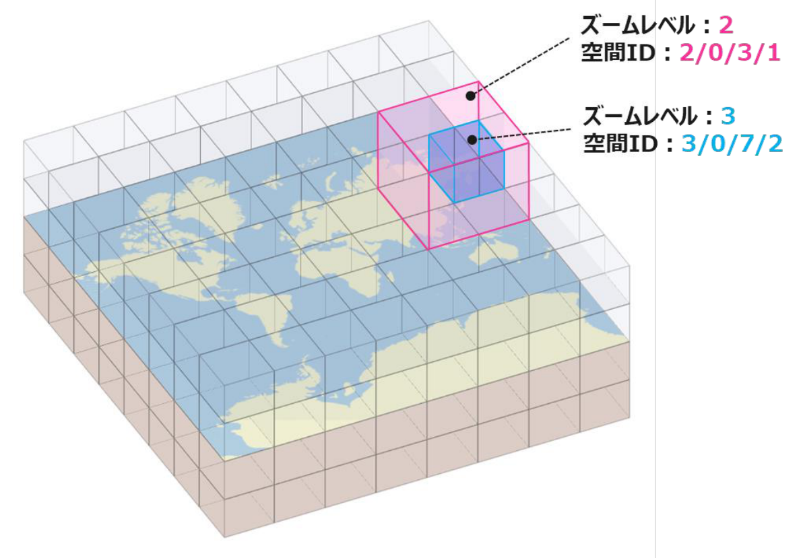
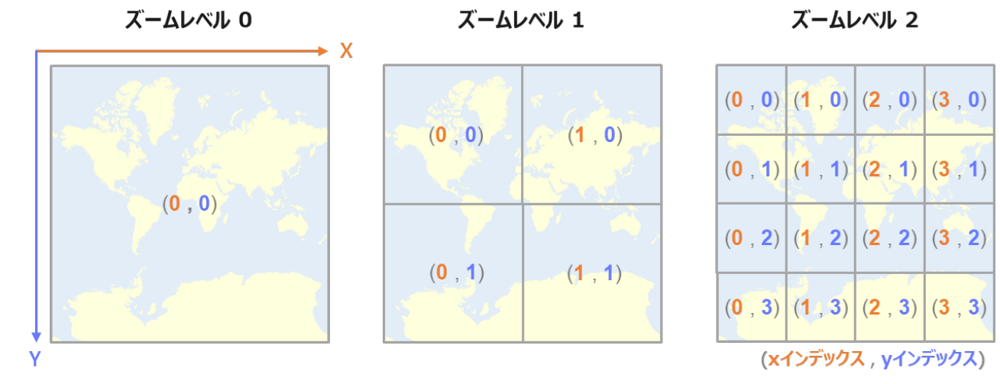
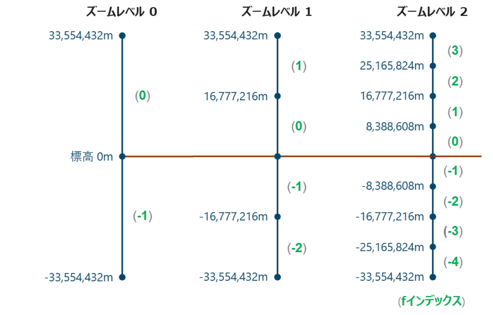
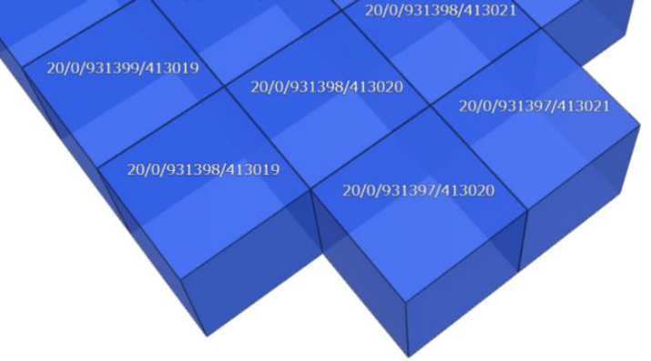

import TablerIcon from '../../../components/TablerIcon.astro';

このページの図の一部は、経済産業省・国土交通省・国土地理院・NEDO・IPA が公開している「4 次元時空間情報利活用のための空間 ID ガイドライン（1.2 版）」から引用しています。詳しい仕様はガイドライン本文を参照してください。

## 空間ID

空間ID は、地球上の 3 次元の空間を直方体のマス（空間ボクセル）に区切り、1 つ 1 つのマスに付けた番号です。Kasane は、このマスごとに値を保存します。

```text
{z}/{f}/{x}/{y}        例：20/0/931389/412900
```

| 記号 | 意味 |
| --- | --- |
| `z` | ズームレベル（0〜30）。マスの細かさ |
| `f` | 高さ方向の番号（標高 0m が境目。地下は負の数） |
| `x` | 東西方向の番号 |
| `y` | 南北方向の番号 |



<p class="figure-caption">図 2-3 空間ボクセルのイメージ（出典：経済産業省・国土交通省・国土地理院・NEDO・IPA「[4 次元時空間情報利活用のための空間 ID ガイドライン（1.2 版）](https://www.ipa.go.jp/digital/architecture/Individual-link/rcu1hd000000upgf-att/4dspatio-temporal-id-guideline-v1_2.pdf)」図 2-3）</p>

## ズームレベルと親子関係

ズームレベルが 1 上がるごとに、マスは縦・横・高さがそれぞれ半分になり、1 つのマスが 8 つに分かれます。上の図では、ズームレベル 2 のマス `2/0/3/1` の中に、ズームレベル 3 のマス `3/0/7/2` が入っています。

ある ID の 1 つ上（粗い側）の親は、`f`・`x`・`y` をそれぞれ 2 で割って切り捨てれば求まります。逆に 1 つ下の子は、各インデックスを 2 倍した値と 2 倍 + 1 の値の組み合わせ 8 つです。

```text
20/0/931389/412900 の親（ズームレベル 19）: 19/0/465694/206450
20/0/931389/412900 の子（ズームレベル 21）: 21/0:1/1862778:1862779/825800:825801 の 8 マス
```

{/* スクリーンショット: 親と子を Senri に表示した画面 → src/assets/senri/parent-children.png */}

マスの大きさの目安は次のとおりです。高さはズームレベル 25 でちょうど 1m になるように決められています。横幅は Web メルカトル図法で区切るため、緯度が高いほど小さくなります。

| z | 高さ | 横幅（東京付近） |
| --- | --- | --- |
| 15 | 1,024 m | 約 1 km |
| 20 | 32 m | 約 31 m |
| 25 | 1 m | 約 1 m |

## インデックスの数え方

水平方向は、Web 地図と同じ Web メルカトル図法の範囲（経度 −180〜180 度、緯度 約 −85〜85 度）をズームレベル 0 の 1 マスとし、ズームレベルが上がるたびに縦横を 2 分割します。`x` は西の端（経度 −180 度）から東へ、`y` は北の端から南へ、0 から数えます。



<p class="figure-caption">図 2-6 水平方向の分割とインデックスの割り当て（出典：経済産業省・国土交通省・国土地理院・NEDO・IPA「[4 次元時空間情報利活用のための空間 ID ガイドライン（1.2 版）](https://www.ipa.go.jp/digital/architecture/Individual-link/rcu1hd000000upgf-att/4dspatio-temporal-id-guideline-v1_2.pdf)」図 2-6）</p>

鉛直方向は、標高 0m を境目に、上下それぞれ 33,554,432m（2<sup>25</sup> m）までをズームレベル 0 の範囲とします。`f` は標高 0m から上へ 0, 1, 2, …、下へ −1, −2, … と数えます。



<p class="figure-caption">図 2-7 鉛直方向の分割とインデックスの割り当て（出典：経済産業省・国土交通省・国土地理院・NEDO・IPA「[4 次元時空間情報利活用のための空間 ID ガイドライン（1.2 版）](https://www.ipa.go.jp/digital/architecture/Individual-link/rcu1hd000000upgf-att/4dspatio-temporal-id-guideline-v1_2.pdf)」図 2-7）</p>

各インデックスが取れる範囲は、`f` が −2<sup>z</sup> 〜 2<sup>z</sup> − 1、`x` と `y` が 0 〜 2<sup>z</sup> − 1 です。

## 緯度・経度・標高から計算する

```ts
function toSpatialId(z: number, lng: number, lat: number, h: number) {
  const n = 2 ** z;
  const latRad = (lat * Math.PI) / 180;
  const f = Math.floor((n * h) / 2 ** 25);
  const x = Math.floor((n * (lng + 180)) / 360);
  const y = Math.floor((n / 2) * (1 - Math.log(Math.tan(latRad) + 1 / Math.cos(latRad)) / Math.PI));
  return `${z}/${f}/${x}/${y}`;
}

toSpatialId(20, 139.7671, 35.6812, 10); // "20/0/931389/412906"（東京駅）
```

隣り合うマスは、`x` や `y` が 1 ずつ違う ID になります。



<p class="figure-caption">図 2-9 各空間ボクセルの空間 ID を表記したイメージ（出典：経済産業省・国土交通省・国土地理院・NEDO・IPA「[4 次元時空間情報利活用のための空間 ID ガイドライン（1.2 版）](https://www.ipa.go.jp/digital/architecture/Individual-link/rcu1hd000000upgf-att/4dspatio-temporal-id-guideline-v1_2.pdf)」図 2-9）</p>

## 地図で見る（Senri）

空間ID が指す場所は、地図ツール Senri で確かめられます。下に埋め込んでいるほか、[別のタブで開く](https://map.airbee.jp/?debug)こともできます。

1. 左上の <TablerIcon name="cube" /> 空間ID ボタンを押します。
2. <TablerIcon name="plus" /> IDを追加 を押すと入力欄ができるので、空間ID を貼り付けます。カンマで区切れば、複数の ID をまとめて表示できます。
3. 表示された場所が見つからないときは、入力欄の右にある <TablerIcon name="target" /> を押すと、その場所へ移動します。<TablerIcon name="trash" /> で入力欄ごと消せます。

<iframe src="https://map.airbee.jp/?debug" title="空間IDの地図表示" loading="lazy" style="width: 100%; aspect-ratio: 16 / 10; border: 1px solid var(--sl-color-gray-5); border-radius: 4px;"></iframe>

画面右側のボタンは次のとおりです。

- <TablerIcon name="refresh" />：範囲の表示と 1 マスずつの表示を切り替えます。RangeId（`20/0/931389:931390/412900` など）を正確に表示したいときに押してください。
- <TablerIcon name="border-outer" />：マスの枠線を表示します。
- <TablerIcon name="pointer" />：マスにカーソルを合わせると、その空間ID が表示されます。
- <TablerIcon name="view-360-number" />：地図を自動で回転させます。

ほかに、<TablerIcon name="plus" /> .txtを追加 で空間ID を並べたテキストファイル（[Nazori](/explore/#実際の都市データを使う) の出力など）を、左上の <TablerIcon name="file-description" /> JSON ボタンで空間ID と値を並べた JSON を読み込めます。値がある場合は、値に応じて色分けされます。

## 時空間ID

空間ID の後ろに時間を付けたものです。同じ場所でも、時間が違えば別の時空間ID になります。

```text
{z}/{f}/{x}/{y}_{i}/{t}    例：20/0/931389/412900_3600/489768
```


<p class="figure-caption">図 2-21 空間 ID と時空間 ID の比較イメージ（出典：経済産業省・国土交通省・国土地理院・NEDO・IPA「[4 次元時空間情報利活用のための空間 ID ガイドライン（1.2 版）](https://www.ipa.go.jp/digital/architecture/Individual-link/rcu1hd000000upgf-att/4dspatio-temporal-id-guideline-v1_2.pdf)」図 2-21）</p>

時間軸は 1970-01-01 00:00（UTC、UNIX 時間の起点）から始まり、時間間隔 `i`（秒）ごとに区切られます。`t` は、UNIX 時間 `u` がその何番目の区間に入るかを表す番号で、`t = floor(u / i)` で求まります。


<p class="figure-caption">図 2-23 分割された時間軸における各要素（出典：経済産業省・国土交通省・国土地理院・NEDO・IPA「[4 次元時空間情報利活用のための空間 ID ガイドライン（1.2 版）](https://www.ipa.go.jp/digital/architecture/Individual-link/rcu1hd000000upgf-att/4dspatio-temporal-id-guideline-v1_2.pdf)」図 2-23）</p>

```ts
const t = Math.floor(Date.UTC(2025, 10, 15, 0, 0, 0) / 1000 / 3600); // 489768
// 20/0/931389/412900_3600/489768 は、2025-11-15 00:00〜01:00（UTC）
```

ガイドラインでは `i` に任意の秒数を使えますが、Kasane v0.7 で使えるのは 1、60、3600、86400 の 4 つだけです。時間を付けない ID は「全時間」を表し、内部では `i = 2^35` として扱われます。

## Kasane での 3 つの表現

Kasane では同じ空間を 3 つの形で書けます。書き込み・検索にはどれを渡してもよく、検索結果の形も `format` で選べます。

SingleId は 1 マスを表す、ガイドラインどおりの形です。

```ts
SingleId.create(20, 0, 931389, 412900);
SingleId.parse("20/0/931389/412900_3600/489768");
```

{/* スクリーンショット: 20/0/931389/412900 を Senri に表示した画面 → src/assets/senri/single-id.png */}

RangeId は、軸ごとの範囲（両端を含む）で直方体を表します。たくさんのマスを 1 つの ID で送れます。

```ts
RangeId.create(20, 0, [931389, 931390], [412900, 412901]); // "20/0/931389:931390/412900:412901"
RangeId.create(0, [-1, 0], 0, 0);                            // 地球全体
```

{/* スクリーンショット: 20/0/931389:931390/412900:412901 を Senri に表示した画面（範囲表示を有効にした状態） → src/assets/senri/range-id.png */}

FlexId は、軸ごとに違うズームレベルを持てる形で、Kasane の内部の保存単位です。`20/0|20/931389|19/206450` は、y 方向だけズームレベル 19（= ズームレベル 20 の 2 マス分）のマスを表します。

## 参考資料

- 経済産業省・国土交通省・国土地理院・国立研究開発法人 新エネルギー・産業技術総合開発機構・独立行政法人 情報処理推進機構「[4 次元時空間情報利活用のための空間 ID ガイドライン（1.2 版）](https://www.ipa.go.jp/digital/architecture/Individual-link/rcu1hd000000upgf-att/4dspatio-temporal-id-guideline-v1_2.pdf)」2026 年 6 月 4 日（図 2-3、2-6、2-7、2-9、2-21、2-23 を引用）
