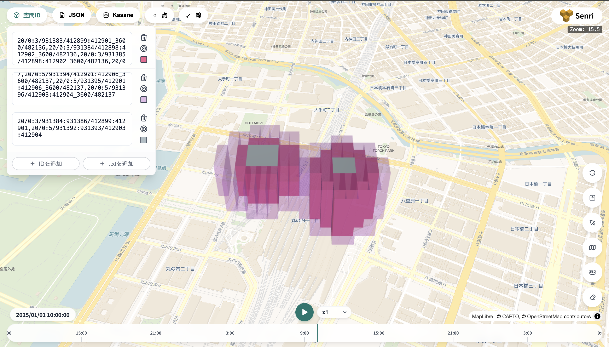

import LangTab from '../../../components/LangTab.astro';
import LangTabs from '../../../components/LangTabs.astro';

ドローンが町を飛ぶときの危険度マップを作ります。



<p class="figure-caption">完成した危険度マップ（灰色：ビル、濃いピンク：0 時台、薄い紫：1 時台）</p>

## 作るもの

危険度は次の 2 つの和とします。

- **建物の近く**：衝突の危険。建物は動かないので、一度書けば変わらない静的なデータ
- **雨**：強いほど危険。時間とともに変わる動的なデータ

```text
建物の危険度（静的）  ＋  雨の強さ（時間ごとに変わる）  ＝  時間ごとの危険度
     ビルのまわりほど高い        0 時台：町全体に小雨、東側は雨
                                 1 時台：町全体に強い雨
```

範囲は東京駅の丸の内側、東西約 900 m × 南北約 700 m です。ズームレベル 20（1 辺約 30 m）を使います。

| Step | やること | 使う機能 |
| --- | --- | --- |
| 1 | 建物を書き込む | テーブル、RangeId、insert |
| 2 | 建物のまわりに危険度を広げる | クエリ（falloff） |
| 3 | 雨を書き込む | 時間を扱うテーブル、時空間ID |
| 4 | 危険度を足し合わせる | クエリ（merge） |
| 5 | 危ない場所を地図で見る | クエリ（filter）、Senri |

各 Step は前の Step で作ったテーブルを使うので、Step 1 から順に実行してください。

## 自分の環境で動かす

各 Step のコードは、ログイン済みのクライアント（`client`）とデータベース `tutorial`（`db`）を受け取る形で書いています。自分の環境では、次のように用意すれば同じコードが動きます。

<LangTabs>
<LangTab lang="typescript">

```ts
import { KasaneClient } from "@airbee-project/kasane-client";

const client = await KasaneClient.connect("https://サーバーのURL", "ユーザー名", "パスワード");
const db = client.database("データベース名");
```

</LangTab>
</LangTabs>
